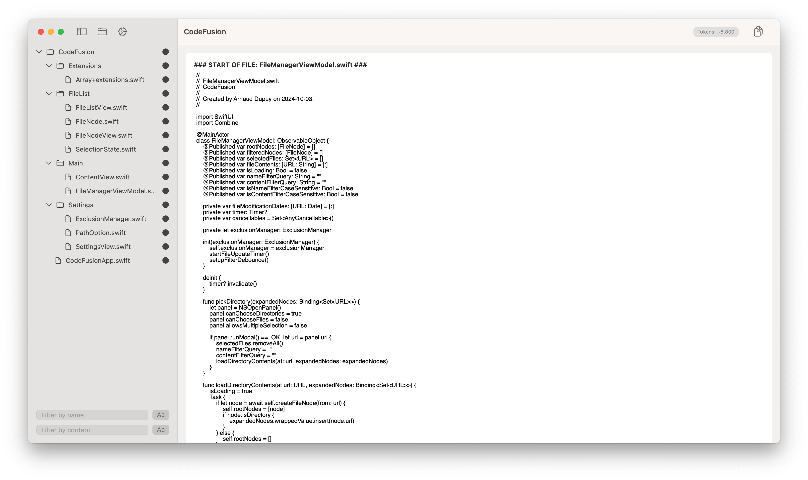

# CodeFusion



**CodeFusion** is a macOS application designed to streamline the process of merging multiple files into a single consolidated copy, making it easier to send content to Language Learning Models (LLMs). Whether you're preparing data for analysis, training, or other machine learning tasks, CodeFusion simplifies file management, selection, and merging with an intuitive user interface.

This is a macOS port (with enhancements) of this project: [dclipca/CodeFusion](https://github.com/dclipca/CodeFusion)

This app is mainly made with o1

## Table of Contents

- [Features](#features)
- [Download](#download)
- [Installation](#installation)
- [Usage](#usage)
- [Configuration](#configuration)
- [Contributing](#contributing)
- [License](#license)

## Features

- **Directory Selection:** Easily select and load directories containing your files.
- **File Filtering:** Filter files by name and content with case sensitivity options.
- **Exclusion Management:** Exclude specific files or folders based on patterns to streamline your selection.
- **File Selection:** Select individual or multiple files, including bulk selection within directories.
- **Content Preview:** View the contents of selected files directly within the app.
- **Merge and Copy:** Combine selected files into a single copy and copy the merged content to the clipboard for easy sharing.
- **Token Counting:** Approximate BPE token count of the merged content to ensure compatibility with LLMs.
- **Dynamic Updates:** Automatically detects and updates changes in the selected files.
- **User-Friendly Interface:** Built with SwiftUI for a seamless and responsive user experience.

## Download

**CodeFusion** is available as a prebuilt application. You can download the latest version directly from the [Mac App Store](https://apps.apple.com/app/codefusion-merge-into-one/id6736599429?mt=12) or from the [Release Page](https://github.com/arnaud512/CodeFusion/releases). This allows you to start using the app immediately without the need to build it from source.

## Installation

You have two options to get **CodeFusion** up and running on your macOS device:

### Option 1: Download Prebuilt Application

1. **Visit the Release Page**

   Go to the [CodeFusion Releases](https://github.com/arnaud512/CodeFusion/releases) page.

2. **Download the Latest Release**

   - Locate the latest release.
   - Download the `.zip` file.

3. **Install the Application**

   - Open the downloaded `.zip` file.
   - Drag the **CodeFusion** app to your `Applications` folder.

4. **Launch CodeFusion**

   - Navigate to your `Applications` folder.
   - Double-click **CodeFusion** to launch the app.

### Option 2: Build from Source

If you prefer to build **CodeFusion** from source, follow these steps:

#### Prerequisites

- **macOS 12.0** or later
- **Xcode 14** or later
- **Swift 5.5** or later

#### Steps

1. **Clone the Repository**

   ```bash
   git clone https://github.com/arnaud512/CodeFusion.git
   ```

2. **Open the Project**

   Navigate to the project directory and open `CodeFusion.xcodeproj` with Xcode.

   ```bash
   cd CodeFusion
   open CodeFusion.xcodeproj
   ```

3. **Build and Run**

   - Select the appropriate target (usually your Mac).
   - Click the **Run** button or press `Cmd + R` to build and launch the application.

## Usage

1. **Select a Directory**

   - Launch **CodeFusion**.
   - Click on the **Open Folder** button in the toolbar to choose the directory containing the files you want to merge.

2. **Filter Files**

   - **Filter by Name:** Enter a query in the "Filter by name" field to search for files by their names. Toggle case sensitivity using the adjacent button.
   - **Filter by Content:** Enter a query in the "Filter by content" field to search within file contents. Toggle case sensitivity as needed.

3. **Manage Exclusions**

   - Open the **Settings** via the gear icon in the toolbar.
   - Navigate to the **Exclusions** tab to add patterns for files or folders you want to exclude (e.g., `.git`, `*.entitlements`, `*.xcassets`).

4. **Select Files**

   - Browse through the file list. Click on individual files or use the selection icons to select/deselect multiple files.
   - Selected files will appear in the preview pane on the right.

5. **Preview Content**

   - Review the contents of the selected files in the preview pane to ensure accuracy before merging.

6. **Merge and Copy**

   - Once satisfied with your selection, click the **Copy Code** button in the toolbar.
   - The merged content, formatted with file boundaries, is copied to your clipboard and ready to be pasted into your desired destination.

7. **Token Count**

   - Keep track of the approximate BPE token count of your merged content, displayed in the toolbar, to ensure compatibility with your LLM requirements.

## Configuration

### Path Display Options

- **Full Path:** Displays the absolute path of each file.
- **Relative Path:** Displays the path relative to the selected base directory.

Configure this setting in the **General** tab within the **Settings**.

### Exclusion Patterns

- Add or remove patterns in the **Exclusions** tab to automatically exclude certain files or folders from your selection.
- Supports wildcard patterns (e.g., `*.log` to exclude all log files).

## Contributing

Contributions are welcome! Whether it's reporting bugs, suggesting features, or submitting pull requests, your input helps improve CodeFusion.

1. **Fork the Repository**

2. **Create a Feature Branch**

   ```bash
   git checkout -b feature/YourFeature
   ```

3. **Commit Your Changes**

   ```bash
   git commit -m "Add Your Feature"
   ```

4. **Push to the Branch**

   ```bash
   git push origin feature/YourFeature
   ```

5. **Open a Pull Request**

## License

This project is licensed under the [MIT License](LICENSE). You are free to use, modify, and distribute this software as per the terms of the license.
